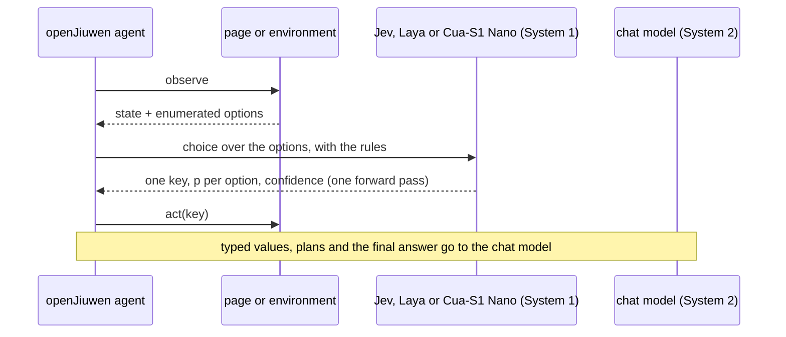

# Architecture: fronts, specs and the shared loop

A System 1 decision model, TypeSafe Jev over HTTP or Laya and Cua-S1 in process, fills the model slot of
openJiuwen agents. The model slot is the `model` argument of an openJiuwen agent constructor. A slot model is a
`Model` subclass: on a decision turn it asks the decision model one `choice` question over the options the
environment enumerates (the browser policy asks one per head) and answers with exactly one tool call; every
other turn goes to a chat model. The agent, its tools, its rails and its checkpoints stay as they are. The evals
put a chat model in the same slot, on the same agent, with the same tools and rules text, and compare the two on
score, seconds, steps and dollars.

Every agent is one module under `s1a/agents/` that ends in a frozen `SPEC` (`s1a/spec.py`): the name,
the description, the rules text the model reads, a budget, and the front-specific pieces. Three fronts share the loop:

- Tool front (`ToolAgentSpec`, `s1a/tool/`): a DeepAgent plays a game through two tools, `observe` and `act`,
  with `ToolDecisionModel` in the slot over a decision model; `random` and `rule` put the two baseline
  models in the same slot model. Agents: `blackjack`, `game2048`, `millionaire`, `alfworld`, `desktop`, `ticket_router`. The loop: `evals/README.md`.
- Browser front (`BrowserAgentSpec`, `s1a/browser/`): `BrowserDecisionModel` fills the slot of openJiuwen's
  browser subagent. Each browser turn is one `decide_many` over the page's controls, one question per head; the chat
  model writes text only for typed values and the final answer. Agents: `flights`, `allrecipes`. Design:
  `docs/browser-front.md`; timing: `docs/benchmarks.md`.
- Rail front (`RailSpec`, `s1a/rails.py`): `DecisionModelRail` asks one question at one DeepAgent callback hook,
  acts on it above a threshold, and is evaluated on a labelled set. Agent: `injection_guard`.

Shared: `s1a/decision_models/` (the decision-model interface, the Jev, Laya and Cua-S1 adapters, the baselines, the answer
validation; `docs/decision-models.md`), `s1a/decision_models/wire.py` (the HTTP transport and its two backends),
`s1a/config.py` (env loading, the chat model, the browser launch flags),
`s1a/tool/rethink.py` (a rail that blocks repeats and asks for a plan on a stall), `s1a/jobs.py`
(Harbor-shaped job folders), `s1a/browser/profiler.py`
(where a browser run's seconds go).

## Models

| `--model` | who answers | runs | reads |
|---|---|---|---|
| `jev` | [TypeSafe Jev](https://typesafe.ai) | over HTTP with a key; 350 to 500 ms, $0.042 per million input tokens | up to 32K tokens of state |
| `laya` | [Laya](https://huggingface.co/convaiinnovations/laya) (`convaiinnovations/laya`, 0.4B) | in process, `uv sync --extra laya`; no key | a 512 to 1024 token window |
| `cua` | [Cua-S1 Nano](https://huggingface.co/cua-ai/cua-s1-nano-0.1) (`cua-ai/cua-s1-nano-0.1`, 855K) | in process, `uv sync --extra cua`; no key | a 256-byte context (header, goal, state, then rules), 96 bytes per option |
| `random`, `rule` | the tool front's two baselines | in process | the candidates |
| `llm` | the chat model | for the comparison columns | the transcript |

`decision_models.build_model(model_name)` builds the first five; `llm` is not a decision model.

## Entry points

`s1a/run.py` loads a spec by name and dispatches on its type. `s1a/cli.py` (`list`, `run`, `decide`,
`probe`) and `s1a/mcp_server.py` (`list_agents`, `run_agent`, `decide`) sit on it. `s1a/console.py`,
the first import of both, routes the harness logs to files under `runs/logs` before openjiuwen loads. Stdout then holds results and the
MCP stdio protocol only.

Every `run` prints one JSON object on stdout: a tool agent's series summary with its `job_dir`, a browser agent's
answer, a rail's evaluation. A browser agent takes `--model jev|laya|cua|llm`; its policy switches are run-time flags:
`--batch on|off`, `--prefetch on|off`, `--goal-values on|off`. `s1a-mcp` serves the same agents to an MCP host over stdio,
one Runner for the server's lifetime and one run at a time. `uv run python -m evals.table evals/results`
aggregates every job folder per eval and model into one table. `scripts/showcase.sh` plays one visual episode per
eval and model outside the matrix and `python -m evals.replay` renders a pair side by side, with a GIF; see
`evals/README.md`.

Every tool agent, `desktop` included, takes `--model jev|laya|cua|llm|random|rule`, `--rethink on|off`,
`--episodes N`, `--seed S`, `--max-steps`, `--timeout` and `--headed`, and writes a Harbor-shaped job folder under
`evals/results/<agent>/`. Every browser agent takes `--model jev|laya|cua|llm` and `--goal`. A rail takes
`--model jev|laya`, the two models that answer `noul`. `decide` and `probe` take `--model jev|laya|cua`. On a browser
agent `laya` needs `LAYA_MAX_LEN` raised to the page's size; `cua` reads a 256-byte context (header, goal, state,
then rules) and 96 bytes per option, a baseline on any page. Exit codes: 0 for a finished run, including one whose
JSON has `ok: false`; 1 for a run, key, model or file error, one line on stderr; 2 for a usage error (an unknown
agent, a malformed `--state`, `--option`, `@file` or cases file, one line on stderr; bad flags, `--episodes` or
`--max-steps` below 1 or `--timeout` at 0 or below, the usage block). `decide` prints `choice`, `probabilities`,
`confidence` and `ms`.
The harness logs go to files under `runs/logs`.

## Why a decision model is faster

A decision model reads `env.observe()` (or the page probe) each turn and answers in one request of 350 to 500 ms
whose cost does not grow with the episode. The chat model reads the tool-result transcript, which grows every
turn, and writes the tool call as text. Both models see the same observation and the same rules. The model in the slot is the
one difference.

## Dependencies

`openjiuwen` is pinned to a tagged commit on the `jiuwen-jev` branch of
[ThinkFlowLab/agent-core](https://github.com/ThinkFlowLab/agent-core): upstream `develop` plus the decision-policy
slot, `BrowserInstanceConfig.launch_args`, the loop-aware LLM client cache and three browser-runtime fixes, one PR
each on that fork. CONTRIBUTING.md lists the branch layout. The repository runs from a checkout: its data (`evals/2048`,
`evals/millionaire`, `evals/labelled`) sits next to the package, and `s1a.console` refuses to start with one line
when no `pyproject.toml` sits above the package (a wheel install). Its outputs (`evals/results`, `runs/`) go under
the checkout too, or under `S1A_HOME` when that variable is set. The browser agents launch a Chromium through
`@playwright/mcp` (Node). Blackjack and ALFWorld need their extras (`uv sync --extra blackjack`,
`uv sync --extra alfworld` plus `ALFWORLD_DATA`); CONTRIBUTING.md lists every extra.
